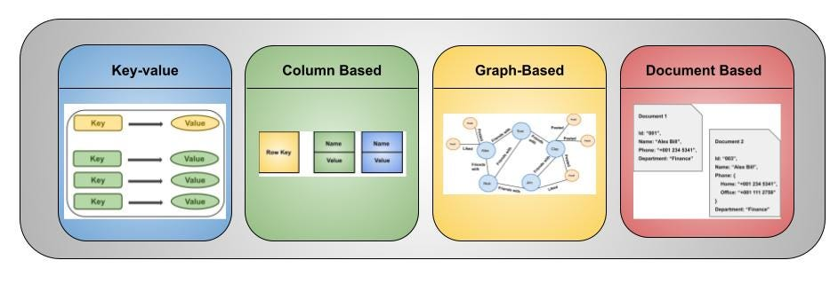
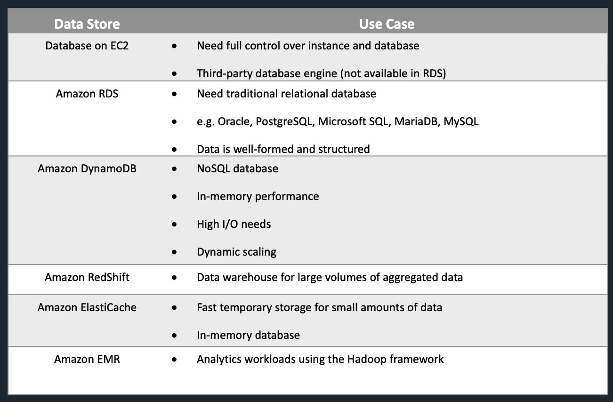

# Content

## Overview

## Different types of DB and

- relational DB vs NoSQL
- their use cases
- trade-offs among, CAP

  - consistency
  - performance
  - scalability etc

- Table 1, columns include:

  type, data model, feature, use case, AWS offered, alternatives

  (feature, alternatives can use db)

introduction to each database offered

    wiki page
    some in depth about design and architecture etc, like diagram from paper etc

    + time series

### How

for each types of db, we compare:

- definition (picture)
  - Data model
  - Feature
  - Use cases
  - Time released
  - Alternatives
- Deployment mode
  - on EC2
  - Amazon managed instances
  - Serverless
- Programming interface
  - SQL support
  - programming languages
- none functional features
  - scalability
  - performance
  - H.A., fault tolerant
  - consistency
  - security
- Design and Implementation

where to find

- course
  - video
  - cheat sheet
- wiki
- Amazon
  - amazon product
  - allthingsdistributed
  - social media
  - developer site
- paper
- other

## Content of courses

### Types of Databases

* Relational / NoSql
  - Key / Value, Redis
  - Document, MongoDB
  - Column, Cassandra
  - Graph, Neo4j
  - Timeseries, InfluxDB

see: https://db-engines.com/en/ranking

* OLTP / OLAP

* AWS Databases

### RDS

Amazon Relational Database Service (or Amazon RDS) is a distributed relational database service by Amazon Web Services (AWS). [wikipedia]

  - Relational
  - 1st released Oct. 2009 MySQL, oracle, SQL Server ...
  - Use cases, on-line store, banking etc, consistency
  - Cloud service
    - Administration
    - scaling
    - failover
  - Alternatives
    - Microsoft Azure SQL Database
    - Google cloud databases

  - Database engines supported

  

        - and RDS Custom

        for applications that require customization of the underlying operating system and database environment.

  - Instance types

        db.t4g.micro    $0.016  2 vCPU,   1G,   5Gbs
        ...
        db.m5d.24xlarge	$10.057 96 vCPU,  384G, 25Gbs

  - Standby and read replica

  - Encryption

#### Aurora

  - compatible with MySql and PostgreSQL
    - migrate to and from
    - code, tools, applications, drivers
    - https://aws.amazon.com/rds/aurora/faqs/
  - Distributed, alternatives like Google Spanner 
    (https://static.googleusercontent.com/media/research.google.com/zh-CN//archive/spanner-osdi2012.pdf)
  - Server less
  - Performance and Scalability
  - 3 AZ replication, Global DB  

    See also:

  - Werner's blog and paper (Aurora: https://www.allthingsdistributed.com/2019/03/)
  - http://nil.csail.mit.edu/6.824/2020/schedule.html

### Dynamo

  - key / value
  - serverless
  - features listed in course table
  - data model
    - Tables, items, attributes
  - use cases
    social networks, and web analytics
  - Serverless, fully managed   
  - Alternatives
    - Azure Cosmos DB
    - Google Cloud Bigtable
  - Features
    - eventual consistency
    - SSL
    - JSON
    - Global tables
    - low latency, DAX

  - None Functional
    - Push button, Horizontal scaling
    - Accelerator
    - Backup
    - Replication
      - replicate to 3 AZs
      - across regions

  - see 6.824 https://pdos.csail.mit.edu/6.824/schedule.html

### Redshift

  - data warehouse
    - columnar storage
    - compression
    - replication, 3 copies
    - backups
    - fault tolerant

  - analytics word-loads
  - SQL, relational, OLAP
  - Alternatives
  
    comparing with BigQuery, Snowflake, Azure Synapse Analytics

    https://db-engines.com/en/system/Amazon+Redshift%3BGoogle+BigQuery%3BMicrosoft+Azure+Synapse+Analytics%3BSnowflake

  - deployed on EC2 instances

  - architecture
    https://docs.aws.amazon.com/redshift/latest/dg/c_high_level_system_architecture.html

  - Amazon Redshift: Ten years of continuous reinvention

    https://www.amazon.science/latest-news/amazon-redshift-ten-years-of-continuous-reinvention

    the paper is in the same folder with this notes

### EMR (Elastic MapReduce)

Amazon EMR is the industry-leading cloud big data solution for petabyte-scale data processing, interactive analytics, and machine learning using open-source frameworks such as Apache Spark, Apache Hive, and Presto.

  - Analytic platforms, managed Hadoop and Spark, HBase, Presto and Flink
  - data analytics, BI
  - Transforming and moving, ETL

see also:

EMR documentation

  https://docs.aws.amazon.com/emr/index.html

  "Streaming Systems: The What, Where, When, and How of Large-Scale Data Processing" by Tyler Akidau (Author), Slava Chernyak (Author), Reuven Lax (Author) 2018

  Chapter 10. The Evolution of Large-Scale Data Processing

### ElastiCache

  - Redis and Memcached
  - in memory, KV
  - high performance, low latency
  - within VPCs
  - on demand or reserved
  - use cases 
    - web session 
    - data caching 
    - leader dashboards 
    - streaming data dashboards

### Athena & Glue

  - query data with SQL from S3, lambda
    - many formats
  - Glue is metadata catalog, ELT service, with data lakes etc

### Kinesis
- streaming data service, serverless
- from 2013 Nov.
- use cases
  - real-time, analytics, IoT, Video
- alternatives
  - Kafka
  - Azure event hub
  - GCP pubSub
- similar concept with Kafka
  - streams, shards, data records, offset, client groups ...

- components
  - Data Streams, producer and consumer
  - Data Firehose, save data to another service
  - Data Analytics, real-time SQL processing
  - Video Streams (2017)

see also:

  https://aws.amazon.com/blogs/aws/amazon-kinesis-real-time-processing-of-streamed-data/

### Other DB and analytics services

- AWS Data pipelines
- Quick Sight
  - BI dashboards
- Neptune, graph db
  - billions of relationships in milliseconds
  - graph query language, TinkerPop Gremlin and W3C’s SPARQL
  - 
- Document DB
  - support mongoDB workloads
  - json
- QLDB, ledge database
- Amazon managed BlockChain

### Other

* Timestream

  Amazon Timestream is a fast, scalable, and serverless time-series database service.

  released 2020 Sep.

  - Use cases:

    IoT, Video streaming etc
    why relational DB not solution

  - How
    - decoupling data ingestion, storage, and query
    - simple implementation
    - cell based (https://www.youtube.com/watch?v=swQbA4zub20)
    - seperate reading and writing
    - partitions in multiple dimensions for scalability
    - memory store and magnetic store
    - SQL grammar, adaptive, distributed query engine, wokers

  - More info

    https://aws.amazon.com/timestream/

    https://www.allthingsdistributed.com/2021/06/amazon-timestream-time-series-is-the-new-black.html

    https://docs.aws.amazon.com/timestream/latest/developerguide/architecture.html

## Some recommended readings

- Werner Vogels
- design data intensive
- UC berkeley database courses, MIT 6.824
- VLDB

    https://vldb.org/

    VLDB is a premier annual international forum for data management and database researchers, vendors, practitioners, application developers, and users. The VLDB 2023 conference will feature research talks, tutorials, demonstrations, and workshops. It will cover issues in data management, database and information systems research, since they are the technological cornerstones of the emerging applications of the 21st century.

## Summary

* Use cases

  https://digitalcloud.training/aws-database-services/#use-cases-for-different-database-types

# Ref.

Udemy AWS course

    cheat sheet
        https://digitalcloud.training/aws-database-services/
        https://digitalcloud.training/additional-aws-services/

AWS certification books

    https://play.google.com/books/reader?id=Hu1wIgAAAEAJ&pg=GBS.PA231

Alternatives
fx, in Azure

Data base ranking

  https://mp.weixin.qq.com/s/oUBQ53uB5OXNFnfXEGPYtw

VLDB

    microsoft top DB researchers

Werner Vogels

  https://en.wikipedia.org/wiki/Werner_Vogels

  https://www.allthingsdistributed.com/

    He joined Amazon in September 2004 as the director of systems research. He was named chief technology officer in January 2005 and vice president in March of that year.

    Vogels described the deep technical nature of Amazon's infrastructure work in a paper about Amazon's Dynamo,[15] the storage engine for Amazon's shopping cart.

papers

    Dynamo: https://www.allthingsdistributed.com/files/amazon-dynamo-sosp2007.pdf
    Aurora: https://www.allthingsdistributed.com/2019/03/amazon-aurora-design-cloud-native-relational-database.html

Timestream

    https://aws.amazon.com/timestream/

    https://www.allthingsdistributed.com/2021/06/amazon-timestream-time-series-is-the-new-black.html

    https://docs.aws.amazon.com/timestream/latest/developerguide/architecture.html

Time line of AWS products

    https://en.wikipedia.org/wiki/Timeline_of_Amazon_Web_Services

    https://www.youtube.com/watch?v=swQbA4zub20

RDS

    https://aws.amazon.com/rds/resources/

    https://en.wikipedia.org/wiki/Amazon_Relational_Database_Service

Knowledge centre

    https://repost.aws/knowledge-center/all

    https://aws.amazon.com/developer/

    * https://aws.amazon.com/architecture/databases/

    https://aws.amazon.com/builders-library/

Graph databases

  https://db-engines.com/en/ranking/graph+dbms
  https://memgraph.com/blog/db-engines-ranking-top-graph-databases#toc-13

Streaming Systems
  
  https://www.amazon.com/Streaming-Systems-Where-Large-Scale-Processing/dp/1491983876