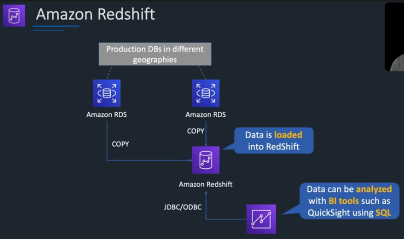
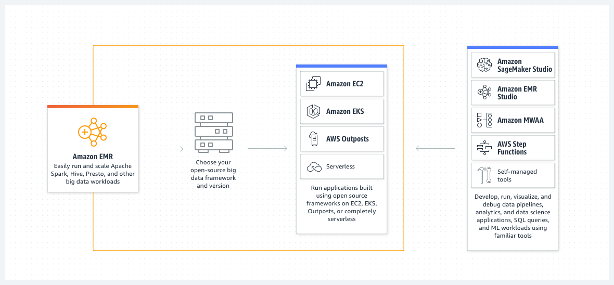

# Types of Databases

> 
Databases are built for a purpose and matching the use case with the database will help you write high-performance, scalable, and more functional applications faster.

> 
Werner Vogels, CTO of Amazon

* Relational 
  - OLTP / OLAP
* NoSql
  - Key / Value, Redis
  - Document, MongoDB
  - Column, Cassandra
  - Graph, Neo4j
  - Timeseries, InfluxDB

from blog: [A one size fits all database doesn't fit anyone](https://www.allthingsdistributed.com/2018/06/purpose-built-databases-in-aws.html)

* Database ranking

&nbsp;&nbsp;&nbsp;&nbsp;https://db-engines.com/en/ranking

# RDS
> Amazon RDS handles all the "muck" of relational database management freeing up its users to focus on their applications and business.

 

  - Relational
  - 1st released Oct. 2009 MySQL, oracle, SQL Server ...
  - Use cases, on-line store, banking etc, consistency
  - Cloud service
    - Administration
    - scaling
    - failover
  - Alternatives
    - Microsoft Azure SQL Database
    - Google cloud databases

  - Database engines supported

  

        - and RDS Custom

        for applications that require customization of the underlying operating system and database environment.

  - Instance types

        db.t4g.micro    $0.016  2 vCPU,   1G,   5Gbs
        ...
        db.m5d.24xlarge	$10.057 96 vCPU,  384G, 25Gbs

  - Standby and read replica

  - Encryption

# Aurora

> Airbnb is a great example of a customer building high-performance and scalable applications with Amazon Aurora.

  - Compatible with MySql and PostgreSQL
    - migrate to and from
    - code, tools, applications, drivers
    - https://aws.amazon.com/rds/aurora/faqs/
  - Distributed, alternatives like Google Spanner 
    (https://static.googleusercontent.com/media/research.google.com/zh-CN//archive/spanner-osdi2012.pdf)
  - Server less
  - Performance and Scalability
  - 3 AZ replication, Global DB  

* Implementation
  - Offloading redo logging: The log is the database
  - cell based architecture
  - 

    See also:

  - Amazon Aurora ascendant: How we designed a cloud-native relational database: https://www.allthingsdistributed.com/2019/03/amazon-aurora-design-cloud-native-relational-database.html
  - http://nil.csail.mit.edu/6.824/2020/schedule.html, Aurora section
  - the paper: "Amazon Aurora: Design Considerations for High Throughput Cloud-Native Relational Databases"

# Dynamo

> 
Consistent single-digit millisecond latency for any scale of workloads. ... 

> 
Snapchat's largest storage write workload, moved to DynamoDB.

Vogels described the deep technical nature of Amazon's infrastructure work in a paper about Amazon's Dynamo, the storage engine for Amazon's shopping cart.

  - key / value
  - serverless
  - features listed in course table
  - data model
    - Tables, items, attributes
  - use cases
    social networks, and web analytics
  - Serverless, fully managed   
  - Alternatives
    - Azure Cosmos DB
    - Google Cloud Bigtable
  - Features
    - eventual consistency
    - SSL
    - JSON
    - Global tables
    - low latency, DAX

  - None Functional
    - Push button, Horizontal scaling
    - Accelerator
    - Backup
    - Replication
      - replicate to 3 AZs
      - across regions

see also:

  - see 6.824 https://pdos.csail.mit.edu/6.824/schedule.html
  - https://www.allthingsdistributed.com/2017/10/a-decade-of-dynamo.html

# Redshift

  - data warehouse
    - columnar storage
    - compression
    - replication, 3 copies
    - backups
    - fault tolerant

  - analytics word-loads
  - SQL, relational, OLAP
  - Alternatives
  
    comparing with BigQuery, Snowflake, Azure Synapse Analytics

    https://db-engines.com/en/system/Amazon+Redshift%3BGoogle+BigQuery%3BMicrosoft+Azure+Synapse+Analytics%3BSnowflake

  - Deployed on EC2 instances

  - Architecture

    https://docs.aws.amazon.com/redshift/latest/dg/c_high_level_system_architecture.html

  - Amazon Redshift: Ten years of continuous reinvention

    https://www.amazon.science/latest-news/amazon-redshift-ten-years-of-continuous-reinvention

  - Dremel: Interactive Analysis of Web-Scale Datasets

    https://research.google.com/pubs/archive/36632.pdf

### EMR (Elastic MapReduce)

Amazon EMR is the industry-leading cloud big data solution for petabyte-scale data processing, interactive analytics, and machine learning using open-source frameworks such as Apache Spark, Apache Hive, and Presto.

  - Analytic platforms, managed Hadoop and Spark, HBase, Presto and Flink
  - data analytics, BI
  - Transforming and moving, ETL

see also:

EMR documentation

  https://docs.aws.amazon.com/emr/index.html

  "Streaming Systems: The What, Where, When, and How of Large-Scale Data Processing" by Tyler Akidau (Author), Slava Chernyak (Author), Reuven Lax (Author) 2018

  Chapter 10. The Evolution of Large-Scale Data Processing

# ElastiCache
> We built Amazon ElastiCache, offering Memcached and Redis, to serve low latency, high throughput workloads, such as McDonald's, that cannot be served with disk-based data stores.

  - Redis and Memcached
  - in memory, KV
  - high performance, low latency
  - within VPCs
  - on demand or reserved
  - use cases 
    - web session 
    - data caching 
    - leader dashboards 
    - streaming data dashboards

### Athena & Glue

  - query data with SQL from S3, lambda
    - many formats
  - Glue is metadata catalog, ELT service, with data lakes etc

### Kinesis
- streaming data service, serverless
- from 2013 Nov.
- use cases
  - real-time, analytics, IoT, Video
- alternatives
  - Kafka
  - Azure event hub
  - GCP pubSub
- similar concept with Kafka
  - streams, shards, data records, offset, client groups ...

- components
  - Data Streams, producer and consumer
  - Data Firehose, save data to another service
  - Data Analytics, real-time SQL processing
  - Video Streams (2017)

see also:

  https://aws.amazon.com/blogs/aws/amazon-kinesis-real-time-processing-of-streamed-data/

### Other DB and analytics services

- AWS Data pipelines
- Quick Sight
  - BI dashboards
- Neptune, graph db
  - billions of relationships in milliseconds
  - graph query language, TinkerPop Gremlin and W3C’s SPARQL
  - 
- Document DB
  - support mongoDB workloads
  - json
- QLDB, ledge database
- Amazon managed BlockChain

### Other

#### Timestream

  Amazon Timestream is a fast, scalable, and serverless time-series database service.

  released 2020 Sep.

  - Use cases:

    IoT, Video streaming etc
    why relational DB not solution

  - How
    - decoupling data ingestion, storage, and query
    - simple implementation
    - cell based (https://www.youtube.com/watch?v=swQbA4zub20)
    - seperate reading and writing
    - partitions in multiple dimensions for scalability
    - memory store and magnetic store
    - SQL grammar, adaptive, distributed query engine, wokers

  - More info

    https://aws.amazon.com/timestream/

    https://www.allthingsdistributed.com/2021/06/amazon-timestream-time-series-is-the-new-black.html

    https://docs.aws.amazon.com/timestream/latest/developerguide/architecture.html

## Neptune
> Thomson Reuters is helping their customers navigate a complex web of global tax policies and regulations by using Neptune.

* fully managed Graph database
* deployed on EC2 instances / Serverless
* Alternatives: Neo4j, Azure Cosmos DB
* The power of relationships in data

  https://www.allthingsdistributed.com/2019/12/power-of-relationships.html

## Some recommended readings

- Werner Vogels
- design data intensive
- UC berkeley database courses, MIT 6.824
- VLDB

    https://vldb.org/

    VLDB is a premier annual international forum for data management and database researchers, vendors, practitioners, application developers, and users. The VLDB 2023 conference will feature research talks, tutorials, demonstrations, and workshops. It will cover issues in data management, database and information systems research, since they are the technological cornerstones of the emerging applications of the 21st century.

## Summary

* Use cases

  https://digitalcloud.training/aws-database-services/#use-cases-for-different-database-types

* 5 dimensions

  - Abstraction layers
  - Alternatives
  - Evolution over time
  - From research to application
  - People

# References

## 0. AWS

  * Werner Vogels, CTO of Amazon

    https://en.wikipedia.org/wiki/Werner_Vogels

    https://www.allthingsdistributed.com/

    He joined Amazon in September 2004 as the director of systems research. He was named chief technology officer in January 2005 and vice president in March of that year.

  * Purpose built databases

    https://www.allthingsdistributed.com/2018/06/purpose-built-databases-in-aws.html

  * Timestream

    https://www.allthingsdistributed.com/2021/06/amazon-timestream-time-series-is-the-new-black.html

    https://docs.aws.amazon.com/timestream/latest/developerguide/architecture.html

  * Best practice for Databases

    https://aws.amazon.com/architecture/databases/

  * Knowledge centre

    https://repost.aws/knowledge-center/all

    https://aws.amazon.com/developer/

    https://aws.amazon.com/builders-library/

  * AWS re:Invent 2018: How AWS Minimizes the Blast Radius of Failures (ARC338)

    https://www.youtube.com/watch?v=swQbA4zub20

  * Modern applications development
  
    https://www.allthingsdistributed.com/2019/08/modern-applications-at-aws.html

  * A decade of Dynamo

    https://www.allthingsdistributed.com/2017/10/a-decade-of-dynamo.html

  * Amazon Aurora ascendant: How we designed a cloud-native relational database: 

    https://www.allthingsdistributed.com/2019/03/amazon-aurora-design-cloud-native-relational-database.html

  * Cell based architecture

    https://www.youtube.com/watch?v=swQbA4zub20&t=1267s

## 1. Udemy AWS course

  a. cheat sheet

    https://digitalcloud.training/aws-database-services/
    https://digitalcloud.training/additional-aws-services/

## 2. Wikipedia

## 5. Books

  * Designing Data-Intensive Applications: The Big Ideas Behind Reliable, Scalable, and Maintainable Systems, by Martin Kleppmann

  * "Streaming Systems: The What, Where, When, and How of Large-Scale Data Processing" by Tyler Akidau (Author), Slava Chernyak (Author), Reuven Lax (Author) 2018

    https://www.amazon.com/Streaming-Systems-Where-Large-Scale-Processing/dp/1491983876

## 6. University Courses, Paper and Conference

  a. UC Berkeley

    https://www2.eecs.berkeley.edu/Research/Areas/DBMS/

  b. MIT 6.824 Distributed Systems

    https://pdos.csail.mit.edu/6.824/

  c. Very Large Data Base Endowment Inc.

    https://www.vldb.org/

    https://vldb.org/2023/

  d. Papers

    - Dynamo: 
    
      https://www.allthingsdistributed.com/files/amazon-dynamo-sosp2007.pdf
    
    - Aurora: 
    
      https://www.allthingsdistributed.com/2019/03/amazon-aurora-design-cloud-native-relational-database.html
    
    - "Amazon Redshift re-invented" 
    
      https://www.amazon.science/publications/amazon-redshift-re-invented

    - Papers referenced in "Streaming Systems"

    - 100 open source Big Data architecture papers for data professionals. 
    
      https://www.linkedin.com/pulse/100-open-source-big-data-architecture-papers-anil-madan/

    - Google spanner

      https://static.googleusercontent.com/media/research.google.com/zh-CN//archive/spanner-osdi2012.pdf

    - Amazon Redshift: Ten years of continuous reinvention
    
      https://www.amazon.science/latest-news/amazon-redshift-ten-years-of-continuous-reinvention

    - Dremel: Interactive Analysis of Web-Scale Datasets

      https://research.google.com/pubs/archive/36632.pdf

  d. Top DB researchers 
    
    https://www.quora.com/Who-are-some-of-the-most-famous-database-researchers

## 6. Udemy Related courses

AWS Certified Data Analytics

  https://nordea.udemy.com/course/aws-data-analytics/?src=sac&kw=aws+certified+an

AWS Certified Database specialty

  https://nordea.udemy.com/course/aws-certified-database-specialty-dbs/

Graph databases

  https://db-engines.com/en/ranking/graph+dbms
  https://memgraph.com/blog/db-engines-ranking-top-graph-databases#toc-13

---

# Content

## Overview

## Different types of DB and

- relational DB vs NoSQL
- their use cases
- trade-offs among, CAP

  - consistency
  - performance
  - scalability etc

- Table 1, columns include:

  type, data model, feature, use case, AWS offered, alternatives

  (feature, alternatives can use db)

introduction to each database offered

    wiki page
    some in depth about design and architecture etc, like diagram from paper etc

    + time series

### How

for each types of db, we compare:

- definition (picture)
  - Data model
  - Feature
  - Use cases
  - Time released
  - Alternatives
- Deployment mode
  - on EC2
  - Amazon managed instances
  - Serverless
- Programming interface
  - SQL support
  - programming languages
- none functional features
  - scalability
  - performance
  - H.A., fault tolerant
  - consistency
  - security
- Design and Implementation

where to find

- course
  - video
  - cheat sheet
- wiki
- Amazon
  - amazon product
  - allthingsdistributed
  - social media
  - developer site
- paper
- other
